# VAYU-READY

[](https://github.com/abishekss2007/VAYU-READY/actions/workflows/ci.yml)
[](https://github.com/abishekss2007/VAYU-READY/actions/workflows/deploy.yml)

> **DEMO DATA – UNCLASSIFIED.** Synthetic squadron data only: no real aircraft, units or people.

On-premise, AI-powered predictive maintenance and fleet availability platform for an air force squadron.
Smart India Hackathon 2026, problem statement **SIH26249** (Air Power – Predictive Maintenance & Fleet Availability, Ministry of Defence).

**Try it:** https://vayu-ready.vercel.app — tap a role under "Demo accounts" (start with Squadron Commander).
API: https://vayu-ready-api.onrender.com/docs. The free API host sleeps when idle, so the first click can take up to a minute.

It predicts component failures before they ground aircraft, joins scattered maintenance data into one record per aircraft, plans maintenance, and raises spares indents early.

- A Commander understands squadron readiness in 10 seconds.
- An Engineering Officer goes from alert to scheduled fix in 3 clicks.
- The AI advises; an authorised engineer decides.

## Contents

- [The problem](#the-problem)
- [Architecture](#architecture)
- [Who uses it](#who-uses-it)
- [Core features](#core-features)
- [How a request is handled](#how-a-request-is-handled)
- [Data model](#data-model)
- [Machine learning](#machine-learning)
- [Maintenance optimiser](#maintenance-optimiser)
- [How the numbers are worked out](#how-the-numbers-are-worked-out)
- [Run it](#run-it)
- [Demo logins and 3-minute demo](#demo-logins-and-3-minute-demo)
- [Tests](#tests)
- [CI/CD](#cicd)
- [Deployment](#deployment)
- [Security](#security)
- [Compliance](#compliance)
- [Repository layout](#repository-layout)
- [What has and has not been verified](#what-has-and-has-not-been-verified)

## The problem

Aircraft availability is low because maintenance data from health-monitoring systems, technical records, spares and maintenance agencies is fragmented, and maintenance is reactive.

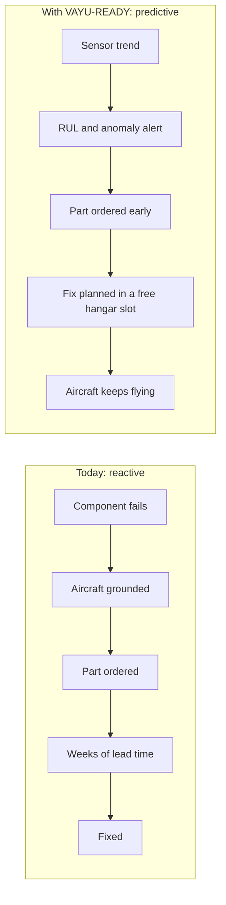

## Architecture

Five layers following ISO 13374 (condition monitoring).

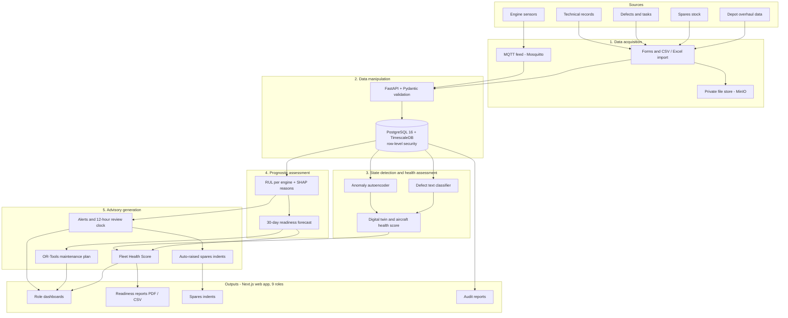

Across every layer: JWT + OTP login, a role check on every route, and a SHA-256 hash-chained audit trail.

| Layer | Technology |
|---|---|
| Frontend | Next.js 14 (App Router), React, TypeScript, Tailwind CSS, shadcn/ui-style components, Recharts |
| Backend | Python 3.11, FastAPI, Pydantic, SQLAlchemy 2.0 |
| Database | PostgreSQL 16 + TimescaleDB (sensor time-series), row-level security |
| Machine learning | scikit-learn, XGBoost, PyTorch, SHAP, joblib |
| Optimiser | Google OR-Tools (CP-SAT) |
| Streaming | MQTT (Eclipse Mosquitto) |
| Background jobs | APScheduler |
| File storage | MinIO (S3-compatible, self-hosted) |
| Tests and CI | pytest, GitHub Actions |

## Who uses it

Nine roles. Each sees only its own screens and data.

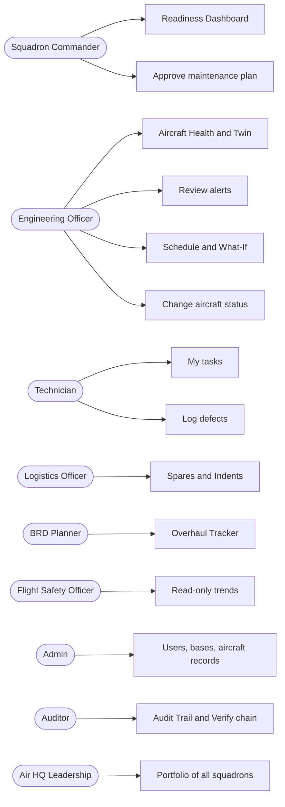

| Role | Email | 2-step | Lands on | Can do |
|---|---|---|---|---|
| Squadron Commander (CO) | co@vayu.demo | yes | Readiness Dashboard | See SQ7 readiness and forecast; approve the plan |
| Engineering Officer (ENGO) | engo@vayu.demo | yes | Aircraft Health | Review alerts, change aircraft status, sign off tasks, run the optimiser (SQ7 only) |
| Technician (TECH) | tech@vayu.demo | no | My tasks | Log defects, mark tasks done (SQ7 only) |
| Logistics Officer (LOGO) | logo@vayu.demo | yes | Spares | Approve and receive indents |
| BRD Planner (BRD) | brd@vayu.demo | no | Overhaul Tracker | Plan depot capacity across squadrons |
| Flight Safety Officer (FSO) | fso@vayu.demo | no | Readiness Dashboard | Read-only |
| Admin (ADMIN) | admin@vayu.demo | yes | Users & Access | Users, bases, aircraft records; no maintenance decisions |
| Auditor (AUDITOR) | auditor@vayu.demo | yes | Audit Trail | Read-only; verify the chain |
| Air HQ Leadership (HQ) | hq@vayu.demo | no | Portfolio | All squadrons and bases |

## Core features

- **Commander dashboard:** Fleet Health Score (0–100) from 5 explainable rules, with the reason for every lost point.
- **Aircraft tracker:** tail number, type, squadron, flying hours, status, mission readiness.
- **Digital twin per aircraft:** latest sensors, RUL per engine, anomaly score, health score, open defects, next maintenance, spares status.
- **RUL prediction** with the top 3 sensor reasons (SHAP); **anomaly detection** that fires earlier.
- **Defect logging with NLP:** free text in, suggested category out, technician confirms.
- **Spares:** stock, lead time, reorder point; an indent is raised automatically when a predicted failure needs a part that is short.
- **Maintenance scheduler** (OR-Tools) and **what-if simulator**.
- **Overhaul tracker** with reminders at 50, 25 and 10 hours left.
- **Tamper-proof audit trail** with a "Verify chain" button.
- **Bulk import** (CSV / Excel) with a clear message for each bad row.
- **Live feed** of sensor values over MQTT and WebSocket.

### Alert life cycle

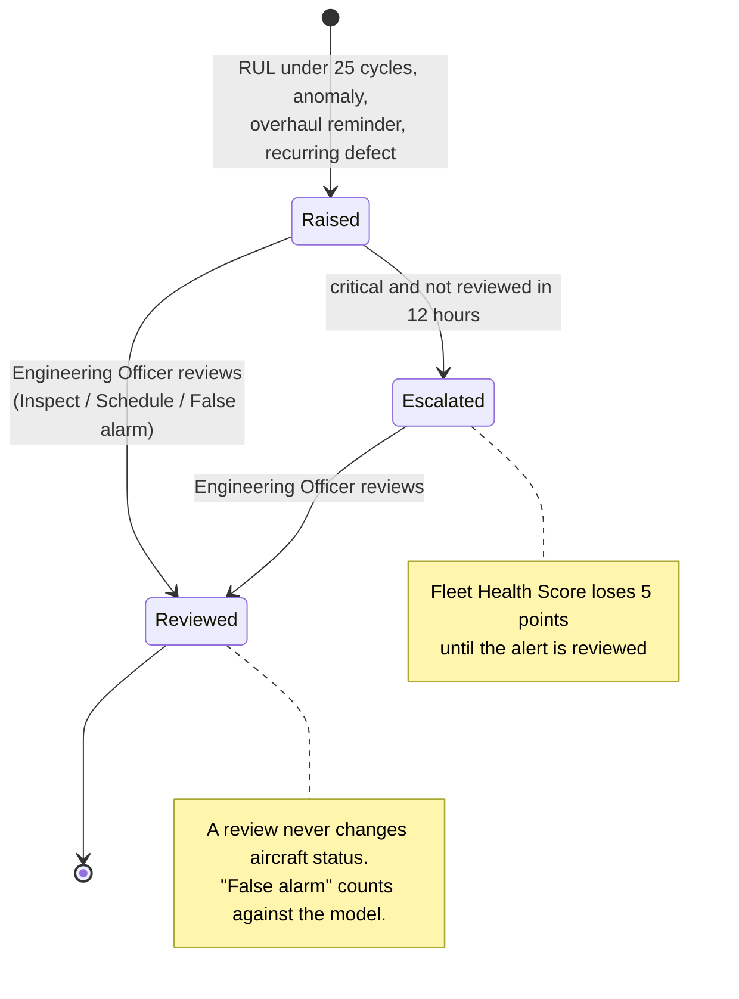

## How a request is handled

Every write follows the same path, in this order.

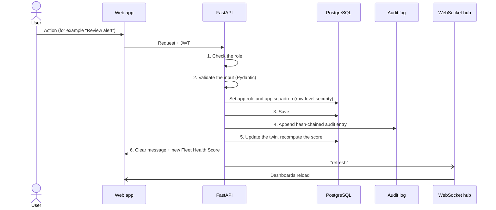

A wrong role gets `403 Your role (X) cannot do this`. Errors are plain English, for example
`Cannot release aircraft: required part HYD-ACT-22 has not been received.`

## Data model

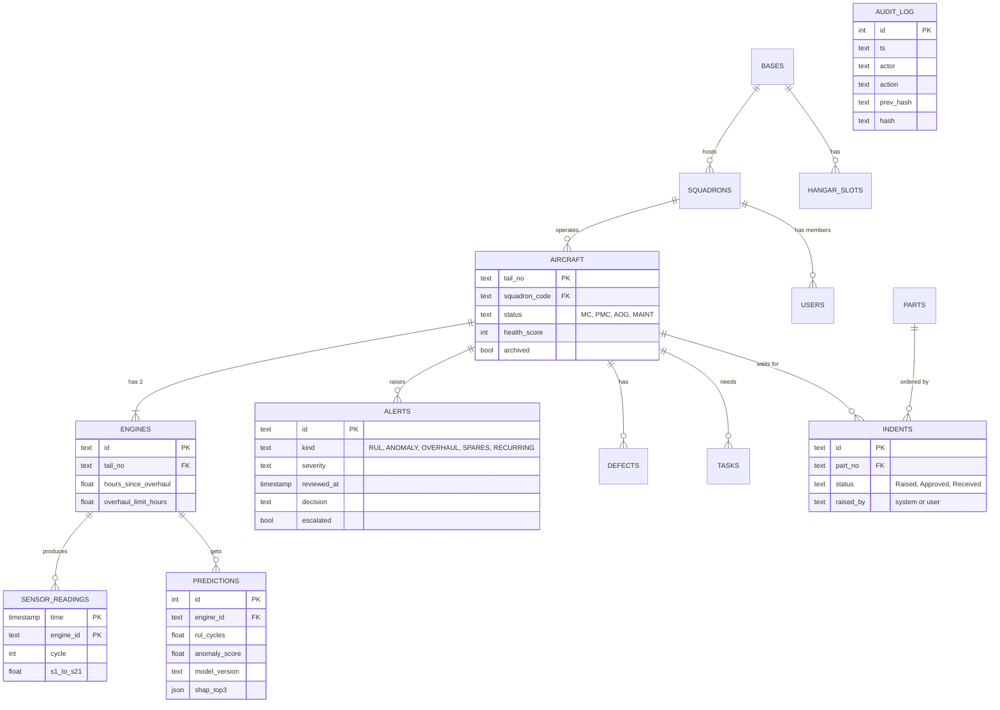

`sensor_readings` is a TimescaleDB hypertable. `audit_log` is append-only: `hash = SHA-256(ts|actor|role|action|detail|prev_hash)`,
and a database trigger blocks UPDATE, DELETE and TRUNCATE. Full schema: [`backend/sql/schema.sql`](backend/sql/schema.sql) and [`backend/sql/rls.sql`](backend/sql/rls.sql).

### Row-level security

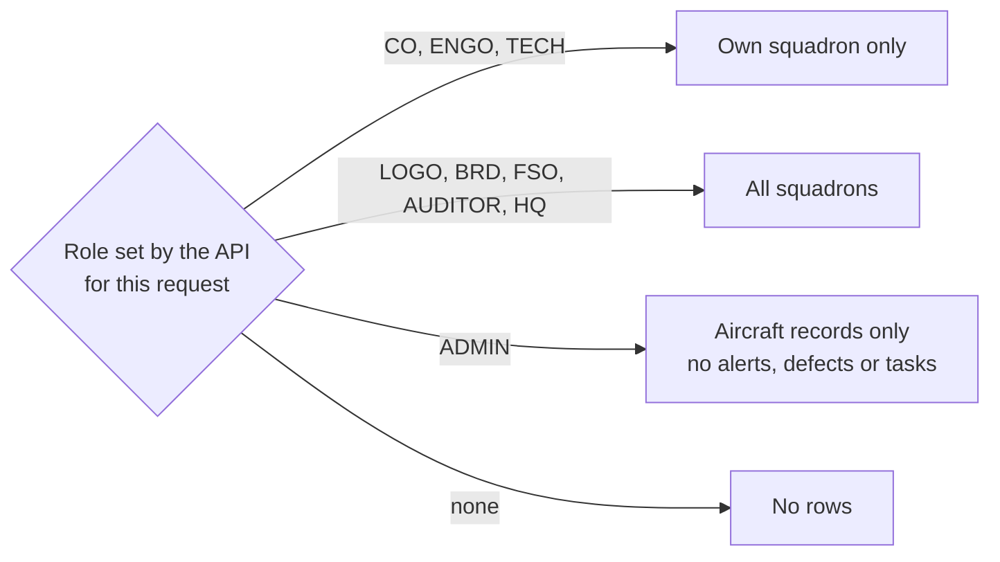

## Machine learning

One command trains everything with fixed seeds: `python -m ml.train` (or `make train`).

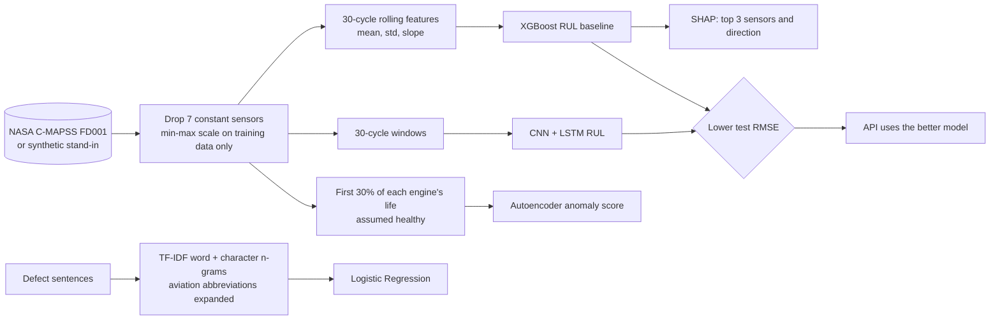

| Model | Purpose | Result in this repository |
|---|---|---|
| RUL, XGBoost (used by the API) | Remaining useful life in cycles, capped at 125 | Test RMSE 18.2 cycles, NASA score 828 |
| RUL, CNN-LSTM | Same, on raw 30-cycle windows | Test RMSE 19.5 cycles |
| Anomaly autoencoder | Flags unusual sensor patterns before RUL drops | Fires about 53 cycles before the RUL<25 alert |
| Defect classifier | Suggests one of 8 categories from free text | 96.5% cross-validated accuracy |
| NGAFID-MC classifier (optional) | Method check on real flight data | Not trained (data not present) |

**These are not NASA C-MAPSS results.** The NASA files were not in `data/cmapss/` when the models were trained, so the pipeline used its
synthetic FD001-like stand-in, and the defect classifier was trained on 200 template-generated sentences.
Put `train_FD001.txt`, `test_FD001.txt` and `RUL_FD001.txt` in `data/cmapss/` and retrain before quoting any figure.
Details, charts and model cards: [`results/report.md`](results/report.md).

The cycle column is never used as a feature (it would leak the label). Validation is split by engine, not by row.

## Maintenance optimiser

Google OR-Tools CP-SAT chooses a start day (or "not scheduled") for each needed task over 30 days.

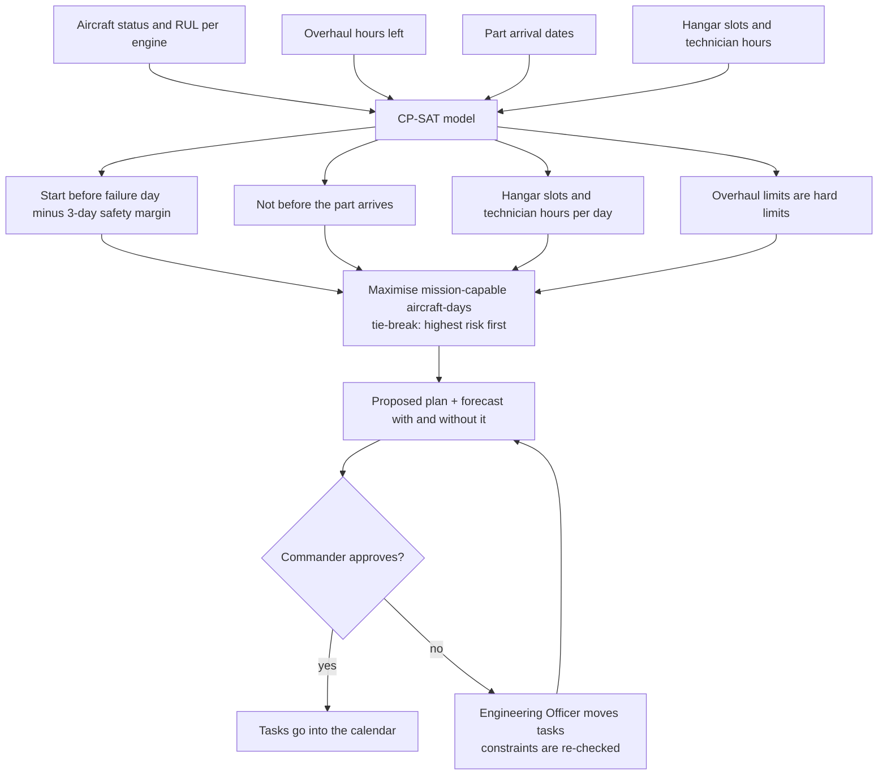

## How the numbers are worked out

**Fleet Health Score** = 100 minus:

| Rule | Points |
|---|---|
| Forecast availability in 9 days against the 75% target | 1 per 1.4% shortfall, rounded, max 20 |
| Aircraft with a critical RUL alert (under 25 cycles) | 4 each, max 16 |
| Aircraft on ground awaiting spares | 3 each, max 12 |
| Any critical alert not reviewed by an Engineering Officer within 12 hours | 5 flat |
| Any aircraft past its overhaul limit (safety flag) | 10 each |

**Aircraft health** = 100 × lowest engine RUL / 125, minus 10 if the anomaly flag is on, minus 5 per open defect (never below 0).

**Forecast:** an aircraft is down while a hangar task covers the day; an aircraft not mission-capable today stays down until its task finishes;
a predicted failure grounds it on day `RUL / 1.2 sorties per day`; an overhaul limit grounds it on day `hours left / 2.0 flying hours per day`.
The constants are in [`backend/app/config.py`](backend/app/config.py).

**Demo predictions:** the seed script stores each engine's true RUL at its replay point (labelled `scenario-seed`), so the demo numbers are exact.
"Run prediction" on an engine calls the trained model and stores the real output; that can move the score.

### The demo scenario

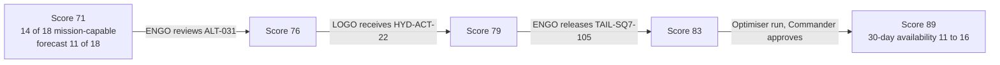

## Run it

### Quick local run (no Docker)

Uses SQLite. Role checks and squadron filters still apply; the MQTT feed and file storage are off.

```bash
python -m venv .venv
```

```bash
.venv/Scripts/python -m pip install -r backend/requirements.txt torch
```

```bash
.venv/Scripts/python run_local.py --reseed
```

In a second terminal:

```bash
npm --prefix frontend install
```

```bash
npm --prefix frontend run build
```

```bash
npm --prefix frontend run start
```

Web app: http://localhost:3000. API docs: http://localhost:8000/docs. On Linux or macOS use `.venv/bin/python`.

To retrain the models: `.venv/Scripts/python -m ml.train`.

### Full offline stack (Docker)

For a base server or demo laptop. Internet is needed only to build the images.

1. Optional but recommended: put the NASA C-MAPSS FD001 files in `data/cmapss/`.
2. Copy `.env.example` to `.env` and change the secrets.
3. `make setup`, then `make train`, then `make up` (same as `docker-compose up --build`).
4. `make seed` reloads the demo data; `make test` runs the tests.

Without `make`:

```bash
docker-compose up --build
```

## Demo logins and 3-minute demo

The login page lists all 9 demo accounts: tap a role and you are in. For 2-step roles the code is already filled in; press **Verify code**.
Every account uses the password `demo123` and the one-time code `482913`. Build the web app with `NEXT_PUBLIC_DEMO_MODE=off` to hide this panel.

Full script with what to say: [DEMO.md](DEMO.md). Judge questions: [QA.md](QA.md). Slide content: [PPT_CONTENT.md](PPT_CONTENT.md).

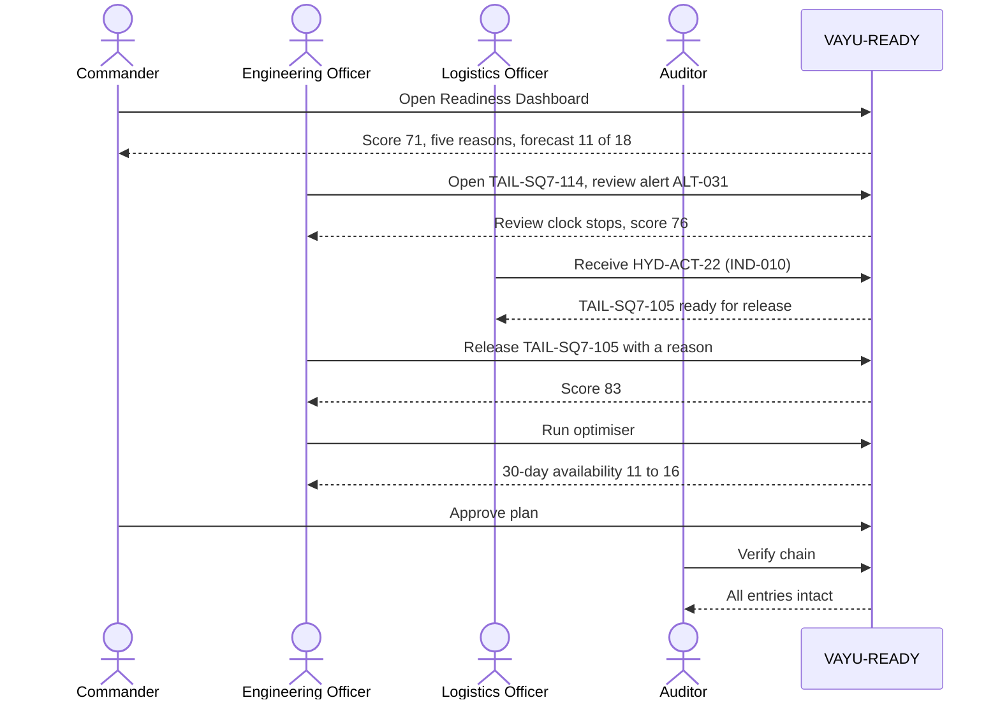

## Tests

```bash
.venv/Scripts/python -m pytest -q
```

39 tests covering:

| Area | What is checked |
|---|---|
| Login | Wrong password is 401; CO needs an OTP; an OTP-stage token cannot call the API; lock after 5 failed logins; 15-minute session |
| Roles | Technician cannot open the dashboard; Admin cannot see alerts or defects; FSO and Auditor are read-only |
| Squadron privacy | The SQ7 Engineering Officer cannot see SQ12 aircraft |
| Score | 71, then 76 after the review, then 83 after the part is received and the aircraft released |
| Alerts | RUL under 25 raises a Critical alert; unreviewed critical alerts escalate after 12 hours |
| Spares | Out-of-stock part auto-raises an indent; receiving a part does not release the aircraft without ENGO sign-off |
| Airworthiness | AI cannot change status; two-person sign-off; overhaul-limit lock |
| ML and NLP | RUL is between 0 and 125 with 3 SHAP reasons; RMSE under 20; "hyd leak near left MLG actuator" is Hydraulics |
| Optimiser | Never more than 2 hangar slots per day; the plan never loses aircraft-days; what-if under 2 seconds |
| Audit | Chain verifies; UPDATE and DELETE on `audit_log` fail; tampering is traced to the exact entry |
| Compliance | 72-hour breach timer; 6-hour CERT-In timer; 180-day log retention; privacy notice; bulk-import row errors |

By default the suite uses SQLite. Set `TEST_DATABASE_URL` to run the same suite against PostgreSQL (CI does both).

## CI/CD

Two GitHub Actions workflows in [`.github/workflows/`](.github/workflows/).

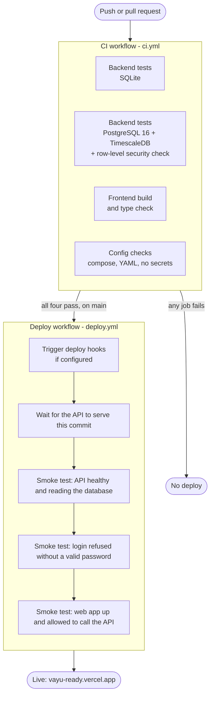

| Workflow | When | What it does |
|---|---|---|
| **CI** (`ci.yml`) | Every push and pull request | Runs the 39 tests on SQLite and again on PostgreSQL 16 + TimescaleDB, checks row-level security as the restricted `vayu_app` role, builds and type-checks the frontend, validates the docker-compose and Render files, and fails if a secret or database file is committed |
| **Deploy** (`deploy.yml`) | After CI passes on `main`, or by hand | Triggers deploys if hooks are set, waits for the new version, then smoke-tests the live API and web app |

**Deploying only after CI passes.** By default Render and Vercel deploy every push to `main` by themselves, in parallel with CI.
To make CI a real gate, turn auto-deploy off on both platforms and add two repository secrets
(Settings → Secrets and variables → Actions): `RENDER_DEPLOY_HOOK_URL` and `VERCEL_DEPLOY_HOOK_URL`.
The Deploy workflow then triggers both deploys itself, only after every CI job is green.
If your addresses differ from the defaults, set the repository variables `API_URL` and `WEB_URL`.

## Deployment

### Offline (main target)

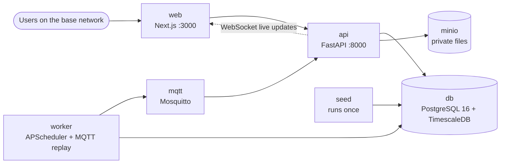

No external calls, fonts, analytics or CDNs at runtime. Optional TLS proxy: `docker-compose -f docker-compose.yml -f docker-compose.tls.yml up --build`.

### Cloud demo copy (for judges)

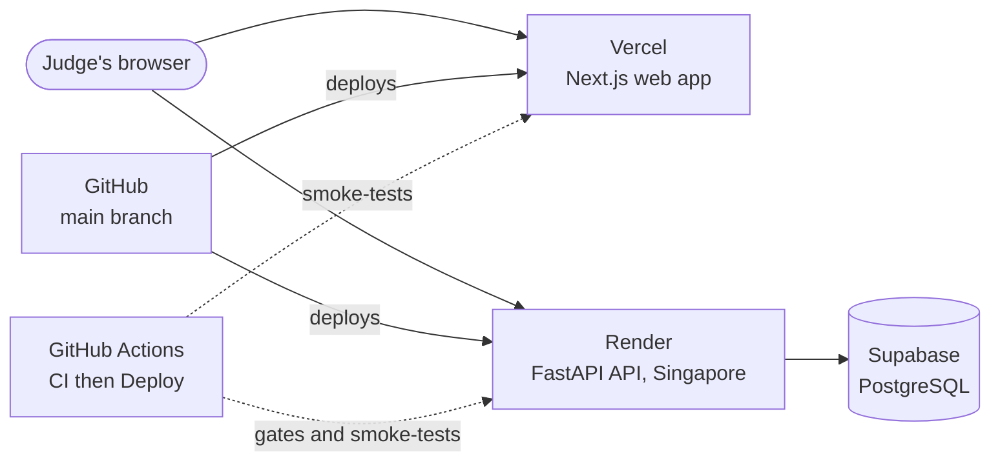

Step-by-step: [DEPLOY.md](DEPLOY.md). The cloud copy has no MQTT live feed, no file storage and no PyTorch
(RUL comes from the XGBoost model; the anomaly score reads 0 on "Run prediction").
It connects as the Supabase owner, so squadron privacy there is enforced by the API's own checks rather than by row-level security.

### Environment variables

| Variable | Used by | Meaning |
|---|---|---|
| `DATABASE_URL` | API, worker | Connection used by the API (the restricted `vayu_app` role in the offline stack) |
| `OWNER_DATABASE_URL` | seed, demo reset | Owner connection that creates tables |
| `APP_DB_PASSWORD` | seed | Password given to `vayu_app` |
| `JWT_SECRET` | API | Signs session tokens |
| `OTP_DEMO_CODE` | API | Fixed one-time code for the demo |
| `CORS_ORIGINS` | API | Comma-separated list of web addresses allowed to call the API |
| `MQTT_URL` | API, worker | Broker address; empty turns the live feed off |
| `MINIO_ENDPOINT` | API | File store address; empty turns file storage off |
| `MODEL_DIR` | API | Where the trained models are |
| `AUTO_SEED` | API | `1` loads the demo data on first start if the database is empty |
| `CLASSIFICATION_LABEL` | API | Banner shown on every page and export |
| `NEXT_PUBLIC_API_URL` | web (build time) | API address the browser calls |
| `NEXT_PUBLIC_DEMO_MODE` | web (build time) | `off` hides the demo logins |

## Security

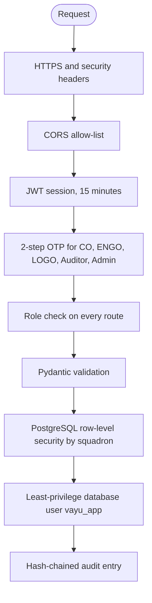

- bcrypt passwords; accounts lock for 15 minutes after 5 failed logins.
- The API's database user cannot drop tables or change `audit_log`.
- "Verify chain" recomputes every hash and names the exact entry that was tampered with.
- Private MinIO bucket with short-lived signed links.
- Every screen and export carries the classification banner (configurable).

## Compliance

The **Compliance** page (Admin, CO, Auditor) shows a checklist with Done / Pending for each item and a link to the feature.

| Area | What the system does |
|---|---|
| Airworthiness | AI is advisory only; status changes need an ENGO and a reason; two-person sign-off; overhaul-limit lock; model cards; false-alarm rate per model |
| ISO 13374 / CBM+ | Each backend module is labelled with its block; maintenance is triggered by evidence of need; hour limits stay as a safety floor |
| Data security | Offline, classification banner, RBAC + RLS, least-privilege database user, hash-chained audit |
| DPDP Act 2023 | Only name, role, squadron and email are stored; notice in English and Hindi on first login; view own data; correction and grievance requests with tracked responses; breach workflow with a 72-hour timer |
| CERT-In Directions 2022 | Cyber incident workflow with a 6-hour timer and the incident types from the Directions; logs kept 180 days; NTP servers and a named Point of Contact in Admin settings |

To do on the base server before real use (shown as Pending on the Compliance page):
encryption at rest for the Docker volumes and MinIO; TLS certificates from the base PKI; scheduling `scripts/backup.sh` and running a restore drill;
clock sync against NIC / NPL servers; replacing the fixed demo OTP with a real OTP provider.

## Repository layout

| Path | What |
|---|---|
| `frontend/` | Next.js web app: `app/` (screens), `components/`, `lib/` |
| `backend/app/` | FastAPI app: `routers/`, `state.py` (twin and scores), `jobs.py` (checks), `planning.py`, `audit.py`, `live.py`, `worker.py` |
| `backend/optimiser/` | `plan.py` (CP-SAT scheduler), `forecast.py` (readiness forecast) |
| `backend/sql/` | `schema.sql`, `rls.sql` |
| `backend/seed.py` | Synthetic demo data: 2 squadrons, 30 aircraft, 60 engines |
| `backend/tests/` | pytest suite and the PostgreSQL row-level security check |
| `ml/` | `train.py`, `evaluate.py`, `infer.py`, `common.py`, `nets.py`, `defect_data.py` |
| `models/`, `results/` | Trained models, metrics, report, charts, model cards |
| `.github/workflows/` | `ci.yml`, `deploy.yml` |
| `docker-compose.yml`, `render.yaml` | Offline stack; cloud API blueprint |
| `docs/` | Architecture diagrams and screenshots |
| `DEMO.md`, `QA.md`, `PPT_CONTENT.md`, `DEPLOY.md`, `CHECKLIST.md` | Demo script, judge Q&A, slide content, cloud deploy steps, final check |

## What has and has not been verified

| Item | Status |
|---|---|
| 39 backend tests on SQLite | Pass locally and in CI |
| Same tests on PostgreSQL 16 + TimescaleDB, plus the row-level security check | Run in CI; see the CI badge at the top |
| Frontend build and type check | Pass locally and in CI |
| Browser walkthrough of all 9 roles and the full demo script | Done locally at 768 px wide |
| Cloud copy (Vercel + Render + Supabase) | Live; smoke-tested by the Deploy workflow |
| docker-compose stack started end to end | **Not run.** The compose files are only syntax-checked in CI |
| MQTT live feed end to end, MinIO storage, backup and restore scripts, TLS proxy | **Not run** |
| Models on NASA C-MAPSS, NGAFID-MC or MaintNet | **Not done.** Results are on synthetic data |

More detail: [CHECKLIST.md](CHECKLIST.md).
