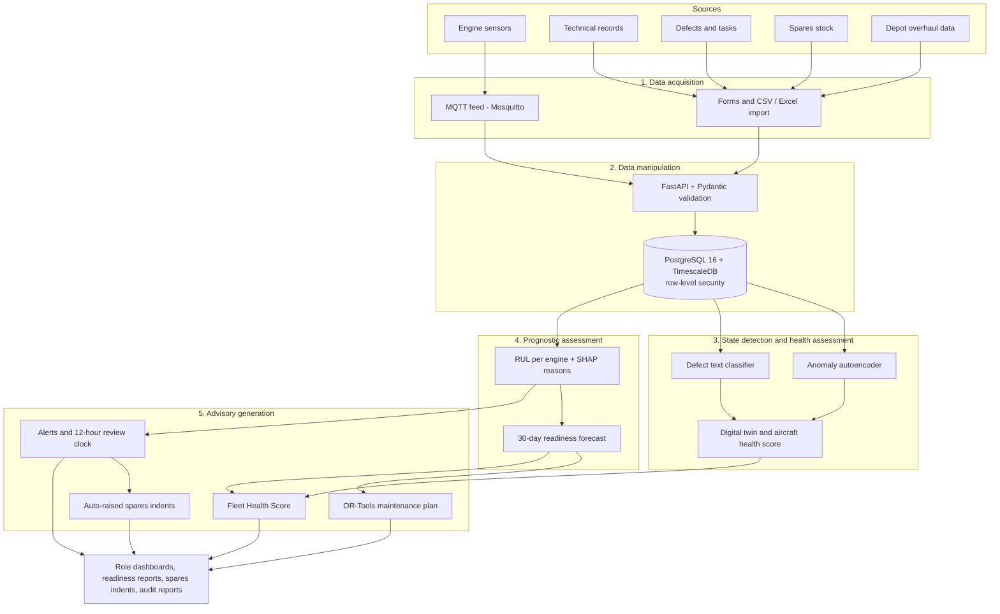

# VAYU-READY architecture

DEMO DATA – UNCLASSIFIED. Five layers following ISO 13374. GitHub renders this diagram; for slides, open this page and take a screenshot.

Across all layers: JWT + OTP login, role checks on every route, SHA-256 hash-chained audit trail. The AI advises; an Engineering Officer decides.

More diagrams (request path, data model, ML pipeline, optimiser, CI/CD, deployment) are in the [README](../README.md).
