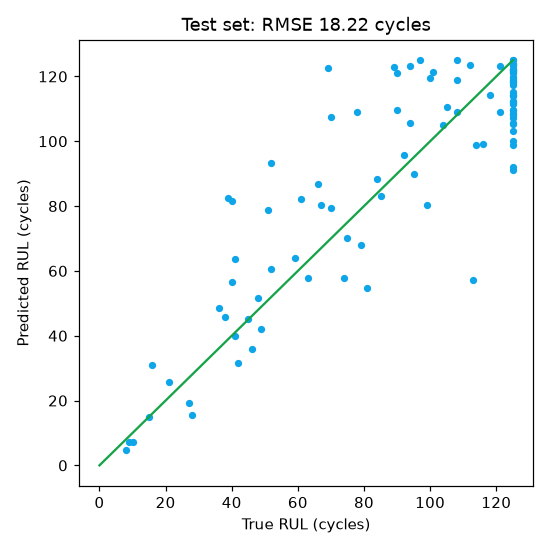
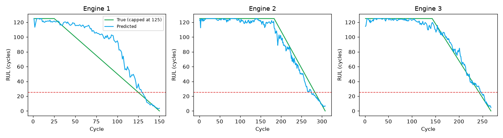
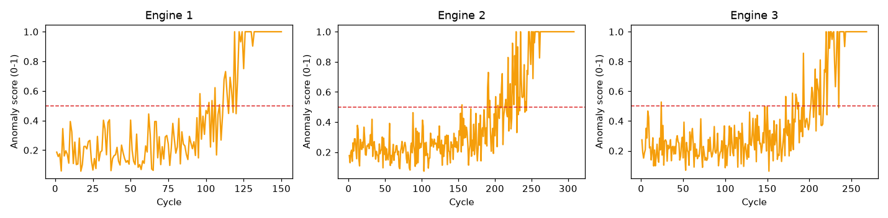
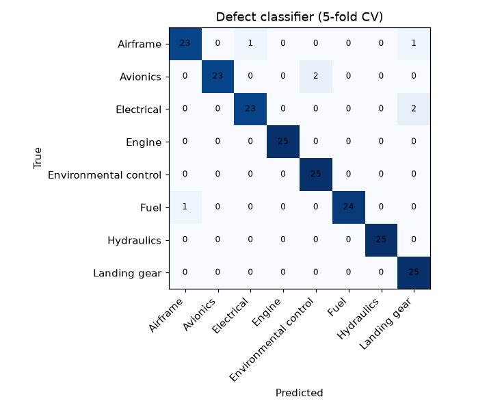

# VAYU-READY model results

- Dataset: **SYNTHETIC FD001-like (NASA files missing)**
- Trained on: 2026-10-03 (random seed 42)
- Features: 14 sensors (constant sensors dropped: s1, s5, s6, s10, s16, s18, s19); the cycle column is never used.

## Model 1: RUL prediction

| Model | Test RMSE (cycles) | NASA score | Mean lead time of first RUL<25 alert |
|---|---|---|---|
| xgb | 18.216 | 827.7 | 30.4 |
| cnnlstm | 19.499 | 1088.7 | 23.9 |

The API uses **xgb** (RMSE 18.216). True RUL is capped at 125 for scoring, the same as the training labels.

## Model 2: anomaly detection

- Type: autoencoder; threshold = 99th percentile of healthy reconstruction error.
- The flag first fires with 83.5 cycles left on average, which is 53.1 cycles earlier than the RUL<25 alert (validation engines: 20).

## Model 3: maintenance-need classifier (NGAFID-MC, optional)

- {"skipped": "NGAFID-MC not found in data/ngafid/ - this optional model was not trained."}

## Model 4: defect text classifier

- Data: 200 synthetic defect sentences (MaintNet not found in data/maintnet/)
- Cross-validated accuracy: 0.965
- 5-fold cross-validated on template-generated sentences; real logbook text will score lower.

## Model cards

### RUL prediction (rul-xgb-2026-10-03)

- Purpose: Estimates remaining useful life (in cycles, capped at 125) for each engine from the last 30 cycles of sensor data.
- Data: SYNTHETIC FD001-like (NASA files missing)
- Metrics: {"Test RMSE (cycles)": 18.216, "NASA score": 827.7, "Mean lead time of first RUL<25 alert (cycles)": 30.4, "Models compared": {"xgb": 18.216, "cnnlstm": 19.499}}
- Limits: Trained on simulated NASA data; must be retrained on service data before real use. Advisory only.
- Approved by: Demo Chief Engineering Officer (fictional)

### Anomaly detection (anomaly-autoencoder-2026-10-03)

- Purpose: Flags unusual sensor patterns before RUL drops. Score 0-1; flag at 0.5 (99th percentile of healthy data).
- Data: SYNTHETIC FD001-like (NASA files missing) - first 30% of each training engine's life (assumed healthy)
- Metrics: {"Type": "autoencoder", "Cycles left when the flag first fires (mean)": 83.5, "Cycles earlier than the RUL alert (mean)": 53.1}
- Limits: Trained on simulated NASA data; must be retrained on service data before real use. Advisory only.
- Approved by: Demo Chief Engineering Officer (fictional)

### Defect text classifier (defect-tfidf-lr-2026-10-03)

- Purpose: Suggests a defect category from a technician's free-text entry. The technician confirms or corrects it.
- Data: 200 synthetic defect sentences (MaintNet not found in data/maintnet/)
- Metrics: {"Cross-validated accuracy": 0.965, "Samples": 200}
- Limits: 5-fold cross-validated on template-generated sentences; real logbook text will score lower. A suggestion only; never used to decide airworthiness.
- Approved by: Demo Chief Engineering Officer (fictional)

### Maintenance-need classifier (optional) (not trained)

- Purpose: Classifies a real general-aviation flight as before or after maintenance, to show the method works on real flight data.
- Data: NGAFID-MC
- Metrics: {"skipped": "NGAFID-MC not found in data/ngafid/ - this optional model was not trained."}
- Limits: General-aviation data, not military aircraft. Not used by the application.
- Approved by: None
